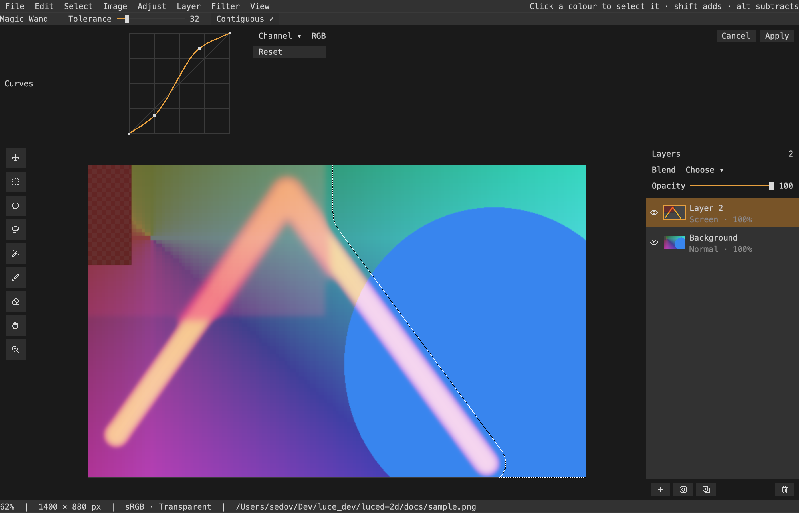

# luced-2d

An image editor written in **Luce**, on its way to being a free Photoshop
replacement: layered documents held as GPU tiles by
[luce-image](https://github.com/dymokomi/luce-image), composed on the GPU and
drawn at any zoom, in a window built from **luce-ui** controls. The design and
the order of work are in [docs/DESIGN.md](docs/DESIGN.md).



## What it does today

- Opens PNG, JPEG, TIFF and EXR pictures as a document, Photoshop `.psd` files
  as layers (names, visibility, opacity, blend modes, clipping), or creates an
  empty one.
- Layers pane: click the eye to hide, drag rows to reorder, rename from the
  Properties pane or Layer › Rename Layer….
- Layer › Layer Style: drop shadow, stroke and outer glow drawn under the
  layer, non-destructively, edited live and saved in `.l2d`.
- Layers with names, visibility, opacity and all 26 Photoshop blend modes,
  composed on the GPU with a cache
  that re-renders only the tiles an edit touches.
- Move tool (`V`): drag with a live preview, or nudge, the layer's pixels;
  Edit › Free Transform (cmd-T) scales, rotates and moves a layer with a live
  preview; Edit › Transform › Skew, Distort and Perspective (or cmd-,
  cmd-shift- and cmd-alt-shift-drag on the box's handles); Edit › Transform ›
  Warp, a Bézier mesh with Arc, Arch, Bulge, Flag, Wave and Rise styles; Edit ›
  Puppet Warp, pins that bend the layer about each other; Filter › Gaussian Blur.
- Image › Crop to Selection, Canvas Size, Image Size; Layer › Duplicate, Move
  Up/Down, Merge Down (cmd-J, cmd-], cmd-[, cmd-E).
- Per-pixel selections: rectangular marquee (`M`), elliptical marquee,
  lasso (`L`) and magic wand (`W`, with tolerance and contiguous options),
  shift adds and alt subtracts, Select › All, Deselect, Inverse,
  Expand, Contract and Feather (cmd-A, cmd-D, cmd-shift-I); marching ants;
  painting and fills stay inside; Fill (alt-Delete) and Clear (Delete).
- Gradient tool (`G`): drag to lay the foreground color fading to transparent
  across the selection, at the brush opacity.
- Eyedropper (`I`): click to pick the flattened color as the foreground.
- Text tool (`T`): click, type, and the text is set into the layer's pixels
  in the foreground color at the chosen size.
- A foreground color swatch in the tool header opens a color editor (RGB
  sliders and hex), beside quick swatches.
- Brush and eraser (`B`, `E`, `[` `]` for size) painted on the GPU with soft
  edges and no dab artefacts; undo and redo of strokes.
- Pan with two-finger scroll, hand tool (`H`) or space-drag; zoom about the
  pointer with a touchpad pinch, the mouse wheel, cmd/ctrl-scroll, the zoom
  tool (`Z`), `+`/`-`, Fit and 100%; pixels stay crisp when magnified.
- An Adjust menu with destructive adjustments: brightness/contrast, hue/
  saturation/lightness, invert, levels (cmd-L), curves (cmd-M: a Photoshop-
  style curve editor per channel), desaturate, threshold, posterize, and
  Filter › Gaussian Blur. Each opens a bar of sliders under
  the header that previews live on the layer; Apply keeps the result as one
  undo step, Cancel puts the pixels back.
- Opens and saves through the desktop's file dialogs. Saving as `.l2d` keeps
  every layer, mask and blend setting (a directory with a `document.prisma`
  manifest and one PNG per layer); PNG, JPEG or TIFF save the flattened picture.

## Build and run

```sh
luc run
```

`luc build` produces `build/Luced 2D.app` on macOS; `luc run -- --smoke` runs
three native frames and exits; `luc run -- picture.png` opens a picture.
`luce-ui` and `luce-image` are expected as sibling checkouts.

## Tests and preview

```sh
python3 tests/run.py       # headless: workspace, view and panels
python3 tools/preview.py   # macOS: captures a real Metal frame into docs/preview.png
```

## Structure

- `src/workspace.luc`: the open document, its file, zoom, offset and selection.
- `src/view.luc`: the canvas widget: checkerboard, the document, pan and zoom.
- `src/actions.luc`: one `Command` per action, as in luced; menus, the tool
  rail and shortcuts present the same instances, enabled by document state.
- `src/settings.luc`, `src/settings_panel.luc`: `~/.luced-2d/settings.toml`
  (new-canvas size, display, theme accent and radius, shortcut overrides by
  command id) and the Settings dialog after eleusis-layout's: a section list
  (General, Color Management, Shortcuts, Theme), a draft edited at the right,
  Save/Cancel. Shortcuts are the application's own `Command`s: pick a row,
  record a chord in the field beneath; a conflict names the other holder.
- `src/tabs.luc`: the open documents as tabs across the viewport (Photoshop's):
  `Workspace` keeps a `Document` per tab and swaps the live canvas and view
  state on switch; New/Open make tabs, ⌘W closes, ⌥⌘] / ⌥⌘[ step.
- `src/colors.luc`: the palette below the tool rail (foreground over
  background, swap X, reset D) and the color editor after Photoshop's: a
  field and a strip whose channel a radio picks (H, S, B, R, G, B, L, a, b —
  the field plots the other two; plus OkLCh L, C, h, gamut-mapped by chroma), new-over-current preview, HSB / RGB / Lab / OkLCh /
  hex fields, a history of committed colors (saved in settings), live on the
  palette, canvas click samples while it is open. The color maths is
  luce-color's (`hsl`, `lab`, `space`, `transfer`).
- `src/panels.luc`: the window: menu bar, contextual tool header (preset
  menu, Size/Hardness/Opacity/Flow/Spacing scrubbers and Brush…, which opens
  the Brush Settings dialog — an accordion of Tip Shape, Shape Dynamics,
  Scattering, Texture, Color Dynamics and Transfer, one section open at a
  time), then a dock of panes after
  eleusis-layout (see `docs/ELEUSIS_UI.md`): the Viewport with its tool rail,
  Layers with its actions on a shelf at the bottom, Properties for the
  selected layer (name field, blend menu, opacity slider and field, flag
  checkboxes); a status bar that shows the hot control's hint; the text
  prompt; and the adjust dialog — a floating card centred over the canvas, as
  Compositor's panels, holding the open adjustment's, blur's, transform's or
  layer style's rows (label, slider, number field) with Cancel/Apply.
- `src/panel_list.luc`, `src/panel_catalog.luc`: every panel a user can open —
  Layers, Properties, History, Color, Swatches, Brushes, Brush Settings,
  Navigator and Info — offered by each dock group's "+" (as a tab, or beside
  the group after Split Right/Down) and by the Window menu, which ticks the
  open ones. A panel is made on first use and kept when closed. Each lives in
  its own file (`color_panel.luc`, `swatches_panel.luc`, `brushes_panel.luc`,
  `history_panel.luc`, `navigator_panel.luc`, `info_panel.luc`); swatches and
  saved brush presets are kept in settings.toml. File › Exit (Quit, ⌘Q, on
  macOS) asks about unsaved documents first.
- `src/layers.luc`: the layer list with thumbnails, masks and clipping.
- `src/theme.luc`: the look, eleusis-layout's greys and orange.
- `src/app.luc`: application composition.
- `src/main.luc`: entry point.
